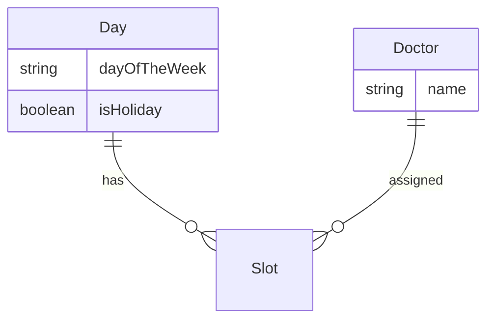

# Entity Relationship Diagram

문법 참고: https://mermaid.js.org/syntax/entityRelationshipDiagram.html

```mermaid
erDiagram
  Day ||--o{ Slot : has
  Day {
    string dayOfTheWeek
    boolean isHoliday
  }
  Doctor ||--o{ Slot : assigned
  Doctor {
    string name
  }
```
